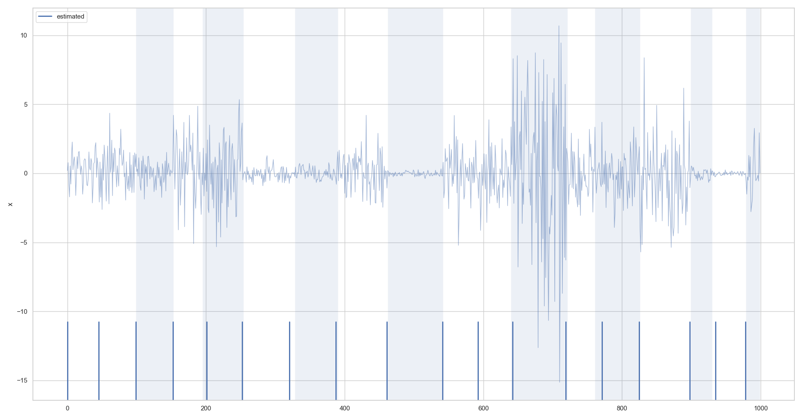
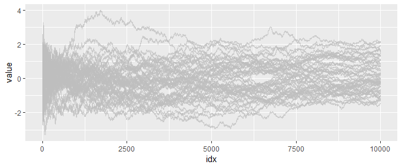
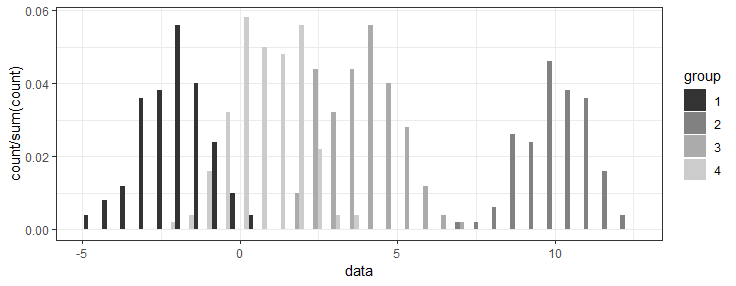
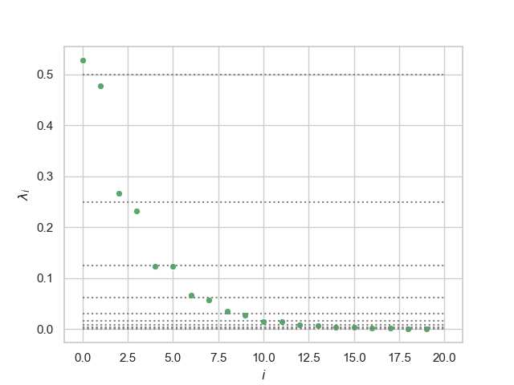
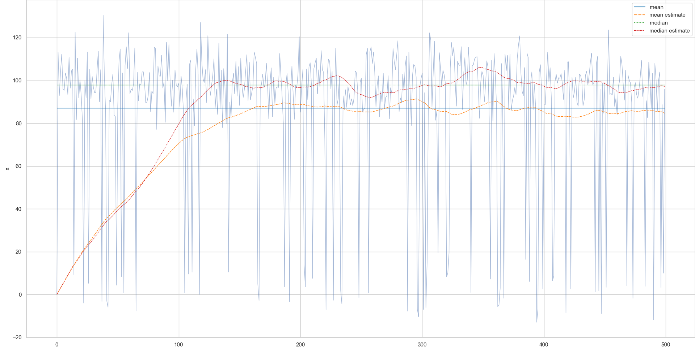
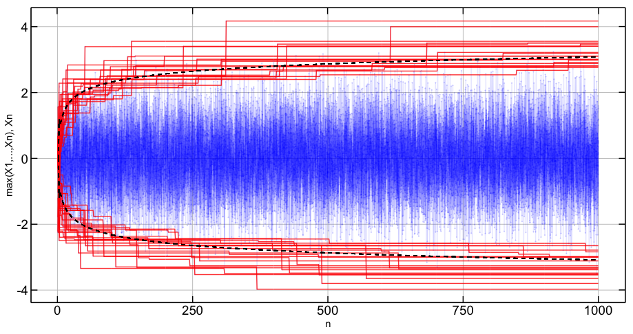
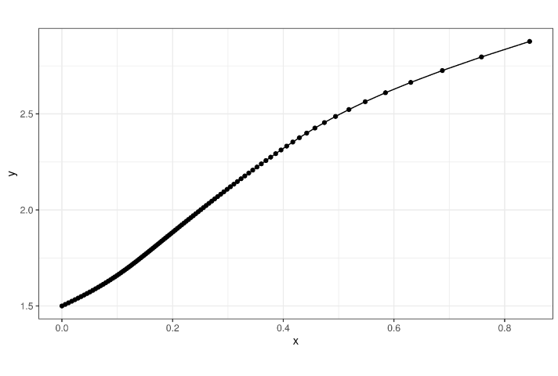
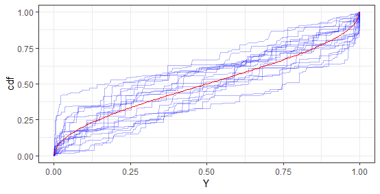

# Statistics & Machine Learning

- [anomaly_detection](#anomaly_detection)
- [CLT](#CLT)
- [constraint_propagation](#constraint_propagation)
- [dirichlet_process_mixture](#dirichlet_process_mixture)
- [discrete_eigenvalue_distribution](#discrete_eigenvalue_distribution)
- [exact-sparse-recorvery](#exact-sparse-recorvery)
- [iterative_median_estimator](#iterative_median_estimator)
- [max_CLT](#max_CLT)
- [optimal_control](#optimal_control)
- [stick_breaking](#stick_breaking)

## [anomaly_detection](anomaly_detection)

## [CLT](CLT)

## [constraint_propagation](constraint_propagation)

## [dirichlet_process_mixture](dirichlet_process_mixture)

## [discrete_eigenvalue_distribution](discrete_eigenvalue_distribution)

## [exact-sparse-recorvery](exact-sparse-recorvery)

## [iterative_median_estimator](iterative_median_estimator)

## [max_CLT](max_CLT)

## [optimal_control](optimal_control)

## [stick_breaking](stick_breaking)

