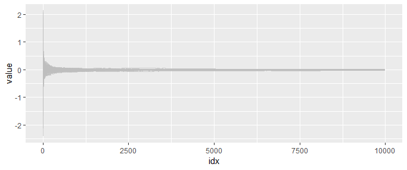

# Statistics & Machine Learning

+ [optimal_control](#optimal_control)
+ [discrete_eigenvalue_distribution](#discrete_eigenvalue_distribution)
+ [stick_breaking](#stick_breaking)
+ [central_limit_theorem](#central_limit_theorem)
+ [dirichlet_process_mixture](#dirichlet_process_mixture)

## [optimal_control](optimal_control)

## [discrete_eigenvalue_distribution](discrete_eigenvalue_distribution)

## [stick_breaking](stick_breaking)

## [central_limit_theorem](central_limit_theorem)

## [dirichlet_process_mixture](dirichlet_process_mixture)

